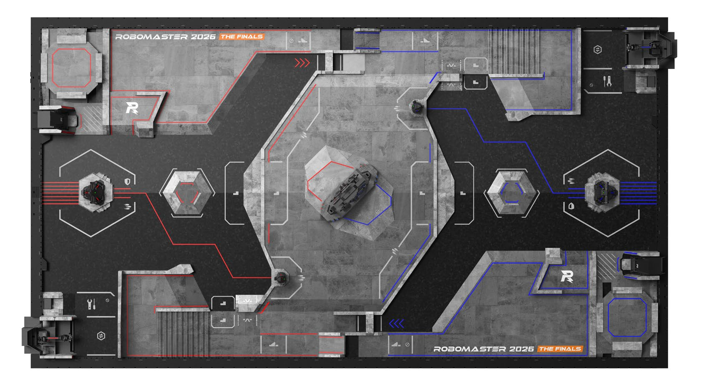
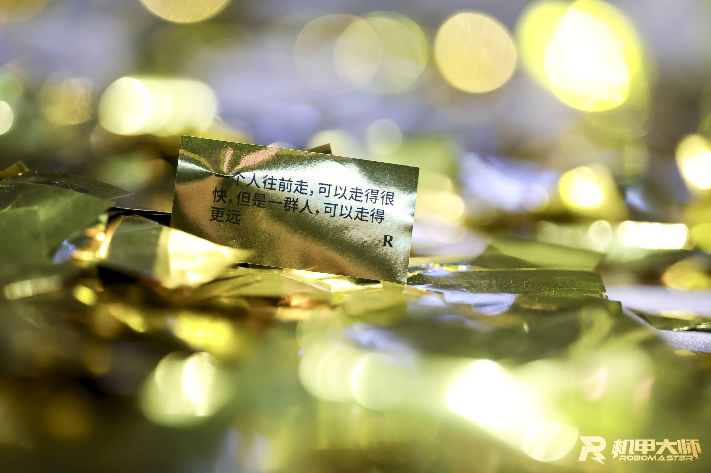
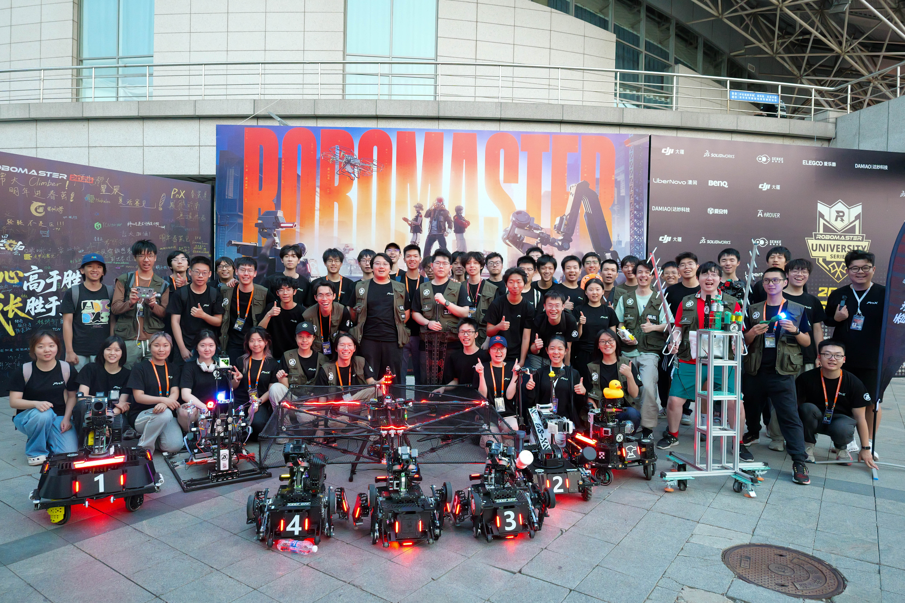
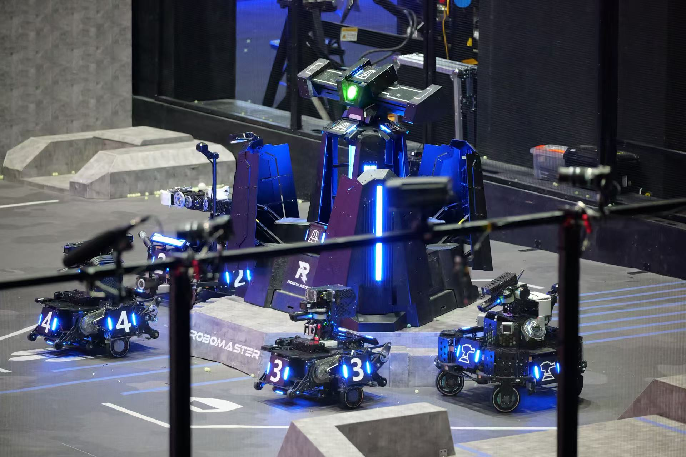
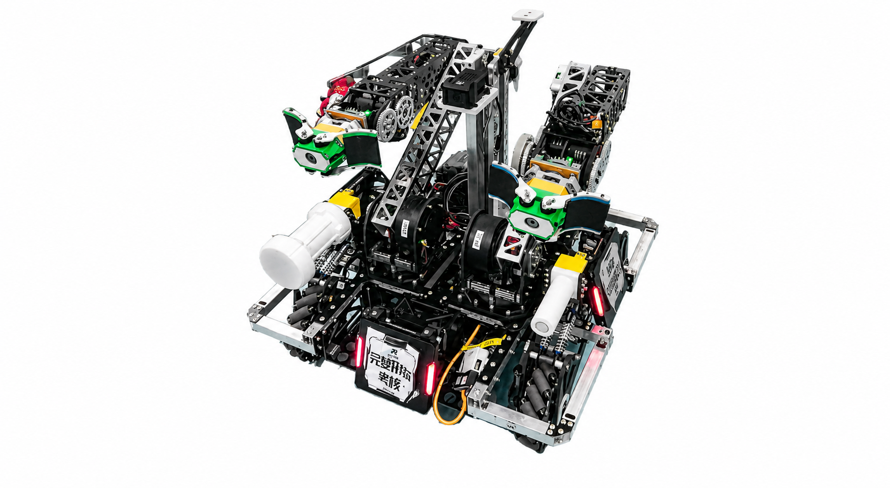
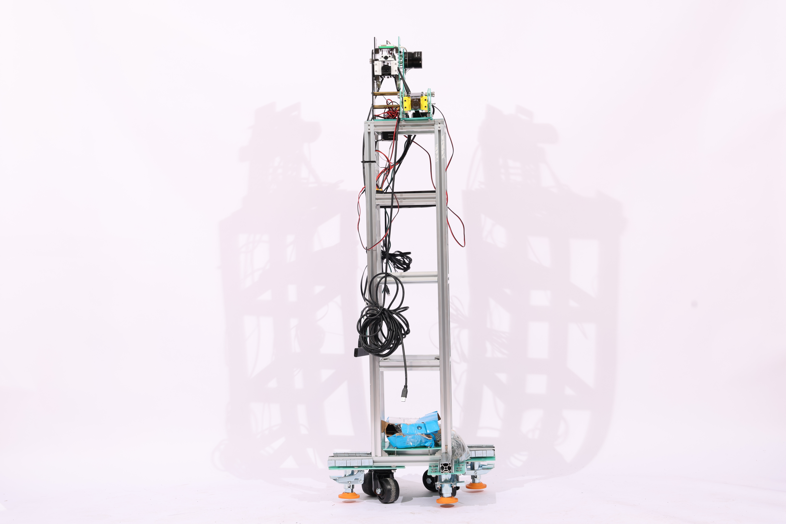
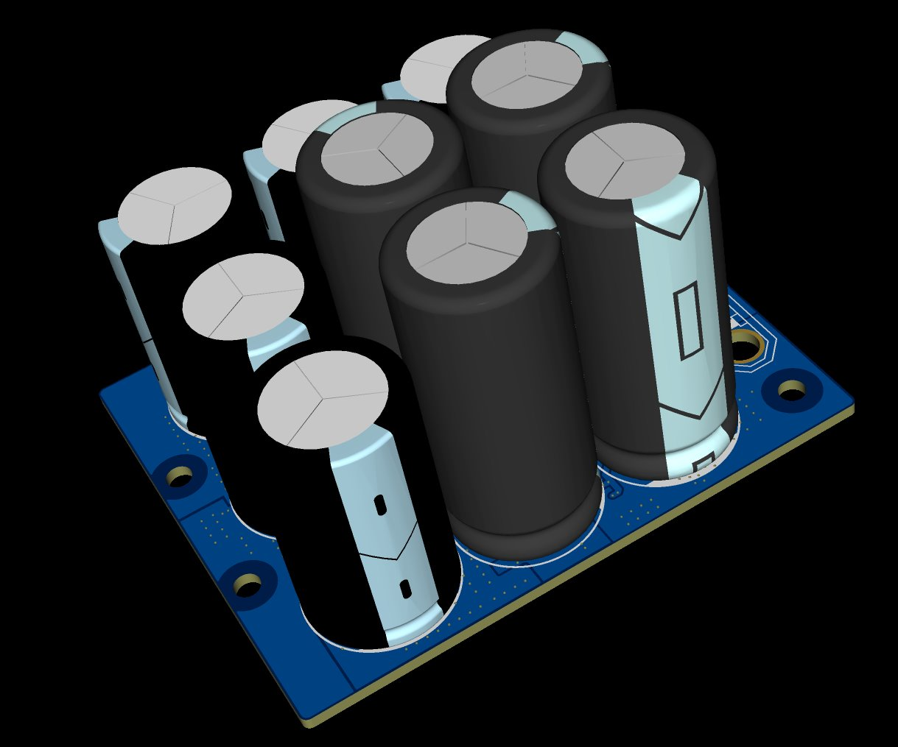
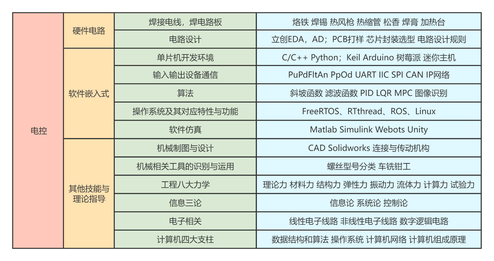

# 招新素材与文案

# RoboMaster介绍

[一项机器人赛事，走出20万青年工程师](https://www.peopleapp.com/column/30052888650-500007643026)

[赛事指南第一期](https://www.bilibili.com/video/BV1xGwezFEUN/?spm_id_from=333.337.search-card.all.click&vd_source=fabd9fb4ab8b4659eaecc77d039b749a)

[赛事指南第二期](https://www.bilibili.com/video/BV18kdPBiEsy/?spm_id_from=333.1387.upload.video_card.click&vd_source=fabd9fb4ab8b4659eaecc77d039b749a)

[赛事指南第三期](https://www.bilibili.com/video/BV1ao3u6LE4W/?spm_id_from=333.1387.homepage.video_card.click&vd_source=fabd9fb4ab8b4659eaecc77d039b749a)

[2026规则发布](https://www.bilibili.com/video/BV1gjdGB4Eba?spm_id_from=333.788.recommend_more_video.-1&trackid=web_related_0.router-related-2589621-k2x2j.1786683740131.568&vd_source=fabd9fb4ab8b4659eaecc77d039b749a)

- 由大疆发起，分RMUL高校联盟赛，RMUC超级对抗赛，RMUA人工智能挑战赛，我们主要参加RMUL和RMUC

- 汇聚全球优秀青年工程师

- 穷究原理，洞悉本质

- 初心高于胜负，成长胜于输赢

- 有98%的人在这里被打败，但是100%的人在这里获得成长（被吓哭）

RoboMaster 承载了大疆对于未来人才的想象和期望，致力于培养勇于创新、追求极致、崇尚实干、具备视野和远见的青年工程师。

截至目前，已有超过 1000 位参与过 RoboMaster 机甲大师赛的优秀人才入职大疆，成为大疆推动科技发展的中坚力量。与此同时，更多从 RoboMaster 成长起来的机甲大师们正成为各行业的中流砥柱，汇入国家科技创新的滚滚浪潮之中。

鉴于参与 RoboMaster 的同学们在赛事中展现了超高的技术热情和专业能力，大疆开设了 RoboMaster 专属招聘通道。

# 战队介绍

[2026赛季纪念](https://www.bilibili.com/video/BV1rsEv6UEMk/)

- PnX战队成立于2023年

- 已经参与3届高校联盟赛和2届超级对抗赛

# 兵种组介绍

[击杀集锦](https://www.bilibili.com/video/BV18rMc6kEhY/?vd_source=fabd9fb4ab8b4659eaecc77d039b749a)

## 成为历史的兵种

### 英雄 —— 苍穹之锤

- 发射42mm大弹丸

- 兼具远程吊射与近战速杀能力，一发命中达到150点\-300点伤害

- 对发射机构精准度具有很高的要求

### 工程 —— 动力引擎

- 机械臂结构\+自定义控制器实现复杂的存取与兑换操作

- 通过兑换能量单元实现

- 与当前的桌面机械臂精细操作、人形机器人移动操作都有密切联系

双臂工程

[梦回救援工程](https://www.bilibili.com/video/BV12hP1zYEUt/?vd_source=fabd9fb4ab8b4659eaecc77d039b749a)

单臂工程

### 无人机 —— 空中之王

- 通过稳定的飞行与悬停实现运动

- 发射17mm弹丸对地面机器人与建筑目标造成伤害

- 具备空中视野，俯视全场

## 传统兵种

### 步兵 —— 钢铁先锋

- 具备灵活的地形跨越能力与战场穿梭能力

- 发射17mm弹丸对敌方弹丸造成伤害

- 同时需要侦察、干扰对方重要输出单位的行动

- 对腿式结构的控制为未来人形机器人移动、四足机器人运动打好了基础

- 自瞄是未来的机器人视觉与物品识别、目标追踪的基础

并联腿步兵

串联腿步兵

全向轮步兵

### 哨兵 —— 未来战士

- 全自动机器人

- 需要自主导航在战场上穿梭，导航稳定性直接决定哨兵下限

- 需要自主决策实现在不同时间点、不同信息状态下的运动位置、打击目标，决策灵活性决定了哨兵的上限

- 是自动驾驶技术的基础

### 飞镖 —— 雷霆之击

- 全自动执行机器人，但是由云台手控制是否开启

- 发射飞镖进行超远程打击

- 具有精确制导和爆炸伤害

### 雷达 —— 全视之眼

- 位于战场的制高点，俯视全局，具有自己独立的算力平台

- 负责机器人的识别、定位，提供对方机器人的位置信息，锁定机器人能够获得易伤效果

- 通过解析信息波，获得对方机器人性能体系、经济体系等信息，能够暴露给己方机器人

- 具有为哨兵做决策的能力

### 自定义客户端 —— 战术外挂

- 将官方客户端无法显示的信息、解析出来的信息通过更直接的方式显示在操作手界面上

- 能做出比官方客户端UI更精美的控件与效果

## 全新兵种

### 重装 —— 超级装甲

- 完成原工程机器人三级装配任务

- 捡拾发射机构升变为英雄机器人

- 同时承担经济获取与大弹丸打击任务

### 无人机 —— 蜂群智能

- 4架超小型无人机、机库起降、无线通信

- 拦截飞镖、干扰发射

- 撞击前哨、基地

## 操作手阵容

### 重装操作手 × 1

- 机器人主要完成既定任务

- 需要操作手极致的冷静和专注

### 步兵操作手 × 2

- 人类决策与操作的胜利

- 执行保护、干扰、击杀等多项任务

- 需要操作手灵活判断场上局势，执行针对性战术并作出即时决策

### 云台手 × 1

- 洞察全局，控制无人机起降与飞镖发射

- 通过小地图、雷达、自定义客户端获取全局大量信息

- 向其余操作手传递全局重要信息，指挥各个操作手

# 技术组介绍

## 组织架构

- 队长 \& 项管：人员管理、进度跟踪、整体决策

- 技术组组长 \& 兵种组组长：细致进度管理、研发方向决策

    - 技术组组长：负责该技术方向的所有兵种问题解决，安排人力，进度跟踪

    - 兵种组组长：负责该兵种所有技术方向的协调、进度跟踪、方案确定

## 机械组

“所有的代码都需要躯体去执行，所有的战术都需要坚甲去承载。在机械组，我们不讨论如果，我们只负责创造。”

简单来说，我们是整个战队的基石。

我们会将脑海里面天马行空的创造力，变成摆在眼前的，看上去令人叹为观止的钢铁巨兽。

我们的工作，包括但不限于：

1、玩转solidworks等建模软件，在虚拟环境中建模出机器人的躯壳，微调各种参数，来让整体的机械结构强度更加可靠，让各种传动、轴系设计更加合理

2、在物理极限之间博弈，我们会运用到例如solidworks simulation等去进行减重和强度的博弈，甚至会去到风洞实验室、材料实验室进行精密的测试

3、亲自上手硬核制造，我们将会3D打印，CNC加工，车铣钳焊，水切割，激光切割，亲自感受从0到1的设计制造过程

4、要会基本的硬件知识，也就是熟悉各种线材，电机的参数，在装完车之后帮忙布线，甚至帮忙焊一些简单的线材和板子

我们在寻找怎样的“头号玩家”？

不需要你现在就是全知全能的大神，但是如果你对于机械结构有天然的痴迷，脑洞打开，能够想出很多天马行空的想法，极致的行动派，动手能力强，那么机械组欢迎你的加入！

当然如果是纯小白也是完全不用担心，要相信我们机械组的培训，我们会把你们培养成老练的机械人

## 硬件组

硬件组究竟是干嘛的？

我先来给大家画一个饼，当你成为一个牛逼的硬件之后，你可以

- 制作电机的驱动

- 完成单片机控制板

- 实现100V以内的升降压来为模块供电

- 制作超级电容给我们的车加速

- 制作无线充电给车或者手机充电

- \.\.\.

其中涉及到的有原理图绘制，pcb板的layout，发加工，焊接，测试这几个过程。

你将了解的是市面上电子产品的底层运行平台的设计，从此之后看着电脑主板你将有无上的崇拜。

在队伍中我们现在主要负责的有 ：

- 所有机器人整车的电气规划链接

- 超级电容

- 无线充电

- 有控镖飞控

- 升降压模块

- 飞机蜂群供电控制

- \.\.\.

## 电控组

电控组，也会被称为嵌入式组

我们的工作可以理解为搭建硬件与算法的桥梁。主要工作是通过**单片机**程序的编写，控制机器人实现基本的运动、基本的通信，包括驱动电机、运动与姿态解算、与裁判系统进行通信、机器人各个状态控制等。

当然在备赛和比赛的过程中，电控的工作还包括焊一些不需要惊动硬件的线、和机械与硬件完成整车布线，以及非常重要的和视觉联调车的各个功能。

电控组的工作可以分为嵌入式和控制两大类，大部分工作集中在嵌入式的开发，普通兵种需要涉及较少量的控制知识，平衡步兵、工程机器人则需要较多的控制和理论知识。

- 嵌入式：包含通信、读取传感器数据、控制单片机各个外设等，是保证机器人稳定运行的基础

- 控制：包含PID控制、姿态解算，进一步可能需要现代与传统控制理论，是让机器人符合物理规律运动，提高机器人运动性能的开发

## 算法组

算法组的主要工作为在高性能平台（minipc）上处理来自于相机/激光雷达的数据，并且与电控组负责的下位机进行通信实现对于整机的控制。

如果电控组的任务是构筑机器人的小脑的话，算法组则是构筑机器人的大脑。无论是编写辅助瞄准的“外挂”，实现对战场全局空间的感知，完成智能兵种的全局自主决策，都是算法组的任务。不过需要强调，算法组的队员不止需要熟练掌握先进智能的算法，更需要扎实的项目落地能力：对小电脑与相机等传感器硬件有判断能力，了解其稳定性与能力边界。熟练掌握计算机系统的运作原理，可以临场完成调试检修工作。

算法组主要方向：

- 自瞄

- 导航

- 雷达兵种

- 有控镖/镖架制导

- 一些奇奇怪怪的软件方向

在算法组中，你将会学会：

- linux/ubuntu 平台的使用

- C\+\+/C/Python 语言基础知识/综合项目开发

- ROS2/OpenCV/Nav2等核心技术栈

- 轻量级神经网络的训练与部署

- 完整自瞄/导航 pipeline

## 软件组（筹）

新建文件夹中。

软件组的主要工作为完善队内软件，包括自定义客户端，模拟器，以及管理系统等

## 宣运组

宣运组是战队连接赛场与外界的窗口，也是支撑战队长期运转的重要力量。从一场比赛的摄影记录，到一篇推文的策划与排版；从招新海报、队服设计，到比赛视频的剪辑；从战队周边的设计制作，到经费记录、物资采购与报销管理——这些工作共同构成了宣运组。

我们负责**记录战队、展示战队、塑造战队，也让战队能够更加高效、有序地运转。**

#### **最主要的工作内容：**

##### 01｜公众号及新媒体运营

我们会负责战队微信公众号等平台的内容策划、文案撰写、排版与发布，包括：

- 招新推文

- 比赛预告与赛事总结

- 战队日常记录

- 队员采访与人物故事

- 技术成果与机器人介绍

- 赛季总结

- 节日及特别活动内容

##### 02｜B站 / 视频号内容制作

宣运组会负责战队在 Bilibili 或视频号等视频平台上的内容制作，包括：

- 比赛精彩集锦

- 机器人测试视频

- 赛季纪录片 / Vlog

- 招新宣传片

- 战队日常

- 机器人技术展示

- 花絮及趣味短视频

从前期拍摄，到素材整理、剪辑、字幕、音乐、封面以及最终发布，你可以参与一条视频从原始素材到成片的完整制作过程。

##### 03\|队服与战队周边制作

**队服**是战队统一形象的重要标志。在校内活动、赛事现场以及对外交流中，统一的队服能够展现良好的精神面貌和团队凝聚力，让战队更具辨识度，也能够有效提升战队的影响力和知名度。

**战队周边**（如队徽、贴纸、徽章、钥匙扣、亚克力制品等）则是 RoboMaster 赛事文化中不可或缺的一部分。比赛期间，各高校战队之间经常会互相交换周边，这不仅是战队之间友好交流的方式，也是展示战队文化、扩大影响力的重要途径。一份设计精美、富有特色的周边，往往能够让更多人记住我们的战队。

宣运组将负责队服及周边的整体策划与制作，包括创意设计、方案确定、与厂家沟通、打样修改、生产制作以及后续发放等工作。

#### 我们希望找到这样的你：

你不需要入队前就会很多东西

我们更看重的是：

- 对 RoboMaster 和机器人感兴趣

- 愿意学习新的东西

- 对自己的工作有责任心

- 有一定审美，愿意表达自己的想法

- 能够认真完成分配的任务

- 愿意和不同技术组的队员沟通

- 对摄影、设计、剪辑、写作、运营中的任何一个方向感兴趣

如果你已经会摄影、PS、视频剪辑、绘画设计、视频剪辑、公众号排版，或者有良好的文字功底，社交沟通能力，那当然非常欢迎。

但如果你现在什么都不会也完全可以从零开始**。宣运组期待你的加入**

# 大致安排

# 老队员分享

## @郭烨

我想先说一句可能不那么像“招新宣传”的话：

> **RoboMaster 不一定会给你一个奖，但它几乎一定会给你留下点东西。**
> 
> 

如果你只是想找一个周期短、容易拿奖、方便写进简历的比赛，那我其实不一定推荐 RoboMaster。

但如果你真的喜欢机器人，愿意花时间，把一个一开始根本不能用的东西，一点点做到能跑、能打、最后真的站上赛场，那我非常推荐你留下来。

---

## 先劝退一下：RoboMaster 真的很累

RoboMaster 的周期很长。

它不是准备两三个星期、交一个作品就结束的比赛。一个赛季可能持续大半年甚至更久。一台机器人会不断经历设计、加工、装配、调试、返工，甚至整个方案推翻之后重新来过。

到了比赛前，你大概率会经历熬不完的夜，也可能调了一整个晚上，最后发现问题只是一个接头松了、一行代码写错了，或者一个非常简单的机械干涉。

而且最现实的一点是：

**你付出了很多，最后也不一定能拿奖。**

所以我一直觉得，RM 最重要的门槛其实不是技术。

不是你现在会不会写代码、会不会画图、会不会焊板子。

而是：

> **你是不是真的喜欢这件事，以及你愿不愿意坚持把它做完。**
> 
> 

---

## 为什么这么累，我们还年年来？

因为 RoboMaster 很接近一次真正的工程项目。

大创也好、电赛也好，都有各自很强的地方。但 RoboMaster 一个非常特殊的地方在于，它会逼着机械、电控、视觉、算法、嵌入式、通信、项目管理这些完全不同方向的人，一起把一个复杂系统真正做出来。

而且这个系统不是做出来展示一下就结束。

它必须长期运行、不断迭代，最后还要真的上场比赛。

所以在这里：

> **“代码能跑”是不够的。**
> 
> 

你的代码得能跑在真正的机器人上；你的机械结构得能加工、能装配；你的电路不仅得通电，还得经历震动、碰撞和长时间运行。

最后比赛的时候，它还不能坏。

这种经历和完成一份课程作业，其实非常不一样。

---

## 我第一年，也什么都不会

我自己第一年参加 RM 的时候，其实也是什么都不会。

那时候我刚大一，周围的人都比我厉害，也不像现在一样已经有这么多教程、文档和积累下来的经验。

很多时候，我能做的就是跟着学长，帮忙干一些比较简单的事情。

到了西南站比赛的时候，我其实也解决不了什么特别复杂的问题，更多的时候就是陪着大家一起调车、一起熬夜。

说实话，当时压力也不小。

但是有一个场景，我到现在都还记得。

就是第一次看到自己经手过的机器人真正被搬到赛场上。

可能我只拧过其中几个螺丝，接过几根线，改过一点很小的东西。

但当它真的动起来，真的代表我们的队伍上场的时候——

**那种感觉和交完一份课程作业完全不一样。**

后来赢下比赛，大家一起在场边欢呼。

现在回头看，我最怀念的甚至不一定是哪一块奖牌，而是那些和一群人一起熬夜、修车、Debug，然后终于看到机器人上场的日子。

---

## 从 0 到 1，然后交给下一届

我算是从创队初期就在这里的成员，所以我也比较清楚，这个队伍一路走过来有多不容易。

我们不是一开始就有成熟的机器人，也没有现在这样的技术栈、教程、文档和管理制度。

很多东西，都是一届又一届队员踩过坑以后，慢慢留下来的。

从机器人应该怎么布线、代码怎么组织，到比赛怎么准备、项目怎么管理、下一届新人怎么培养，都是一点一点积累出来的。

所以你们今天加入的时候，起点其实已经比我们当年高很多了。

但同样的，

> **这个队伍接下来能走到哪里，也已经不是我们这些老队员决定的了。**
> 
> 

而是你们。

---

## 我们到底想找什么样的人？

最后我特别想讲这一点。

### **我们不要求你现在就很厉害。**

你大一什么都不会，这完全正常。

我第一年也是这样。

不会，可以学；做错了，可以改；进度慢一点，也可以慢慢追。

所以我们并不是在找所谓的“神人”，也不是希望每一个新人一进来就能独立造出一台机器人。

我们真正看重的是另外几件事情。

第一，是**合作**。

RoboMaster 从来不是一个人能够完成的比赛。

一个人的能力再强，如果不愿意沟通、不愿意配合，也很难真正把一台机器人做好。

团队里当然会有意见不一致，也一定会有争吵。

这很正常。

机械可能觉得电控的线挡路，电控觉得机械没留安装空间，算法觉得硬件性能不够。

真正重要的不是“从来不吵架”，而是争论之后，我们还能不能回到问题本身：

> **怎么一起把机器人做好。**
> 
> 

第二，是我觉得非常重要的一点——**Ownership，责任感。**

在这里，每个人最终都会负责一些真正属于自己的东西。

可能是一块电路板，一个云台，一套视觉程序，一组通信代码，或者机器人上的某一个机构。

当这个东西出了问题的时候，你不能第一反应永远都是：

“学长，这个怎么办？”

“学长，你教我一下。”

“有没有人直接告诉我答案？”

我们当然会教。

学长会告诉你基本的方法，会带你入门，会帮你分析那些你暂时解决不了的问题。

但我们不是培训班，也不可能像 AI 一样，把每一步答案都事无巨细地送到你面前。

因为真正进入一个工程项目以后，很多问题本来就是没有标准答案的。

你需要自己查资料、看文档、做实验、Debug，先尝试解决它；解决不了，再带着你已经尝试过的方案来讨论。

> **我们希望培养的，不是一个等别人告诉他“下一步做什么”的人，而是一个看到问题以后，会主动想“这个问题我来解决”的人。**
> 
> 

这也是我觉得进入大学以后，需要慢慢摆脱的一种“做题思维”。

高中很多时候，我们面对的是一道已经设计好的题目。

有人告诉你题目是什么，知识点是什么，最后还有一个标准答案。

但机器人不是这样。

有时候甚至没有人能够提前告诉你真正的问题到底在哪里。

**发现问题、定义问题、找到资料、提出方案、试错，然后把事情做完，本身就是你需要学习的能力。**

所以我们不怕你现在不会。

我们真正怕的是，你一直等着别人教你，等着别人催你，最后一个赛季过去了，你还是停留在原地。

---

当然，除了这些听起来比较理想主义的东西，RM 也有非常现实的价值。

最后你会得到一段非常完整的工程经历。

你不是简单地“学过”某个软件、某种语言或者某块单片机，而是真的设计过、做过、Debug 过、推翻过、迭代过一个复杂的机器人系统。

以后无论是做科研、找实习还是就业，这都是一段能够讲得非常具体的经历。

包括大疆等机器人相关企业，也长期非常认可 RoboMaster 的参赛经历，并针对 RM 参赛人才设有专门的招聘和人才通道。

但我还是想说，这些其实都是结果。

真正重要的是：

几年以后，当你回头看的时候，你会知道大学里曾经有一段时间，你和一群人一起，非常认真地想把一台机器人做好。

---

所以最后，如果要总结我们到底想找什么样的人：

**我们不要求你现在就很强。**

但希望你愿意学，愿意合作，愿意负责，也愿意在遇到问题的时候先自己向前走一步。

如果你真的喜欢机器人——

**那就留下来。**

因为明年站在赛场边，看着自己做出来的机器人上场的人，

**可能就是你。**

# 参考资料

[哈工大竞培营](https://space.bilibili.com/46946247/lists)

[中科大电控](https://space.bilibili.com/337732684/lists/1043942?type=season)

## 图片直播链接

•2026 全国总决赛： [https://www\.xxpie\.com/m/album?id=6a4e2a26a6f44227be62780c\&source=SHARE\_LINK\&r=1766](https://www.xxpie.com/m/album?id=6a4e2a26a6f44227be62780c&source=SHARE_LINK&r=1766) 

•2026 赛季区域赛： [https://www\.xxpie\.com/m/album?id=69fca7f595e0d24fcfb46b9b\&source=SHARE\_LINK\&r=2157](https://www.xxpie.com/m/album?id=69fca7f595e0d24fcfb46b9b&source=SHARE_LINK&r=2157) 

•2025 赛季超级对抗赛（包含全国赛、复活赛、区域赛）： [https://www\.xxpie\.com/m/album?id=682164f4c31a8f205c179129\&source=SHARE\_LINK\&r=9682](https://www.xxpie.com/m/album?id=682164f4c31a8f205c179129&source=SHARE_LINK&r=9682) 

